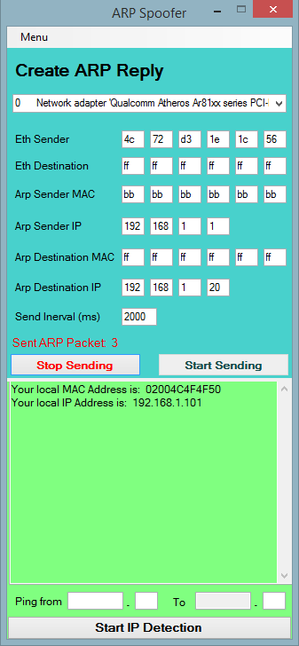

# About project
### Quality: **hacky**
### Year of creation: 2014

## Scale of quality
**professional**
maintainable, scalable and performing -> well thought out architecture, clean structure, complete documentation

**prototyping**
maintainable and scalable to a certain extent -> rough architecture, clean structure, readable

**OK**
maintainable -> clean structure, readable

**hacky**
just good enough to run

# ARP-Spoofer
Network Security Testing Tool (arp spoofing and ping range scanning) I've built to learn about network programming using C# with Windows Forms and LIBPCAP.

